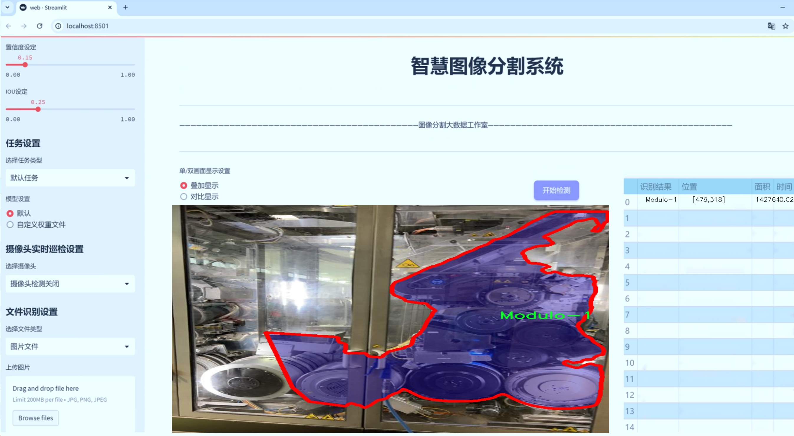
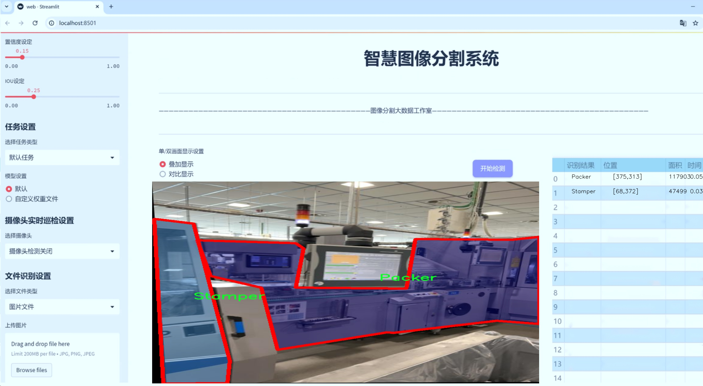
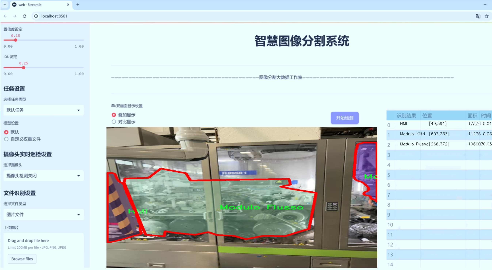
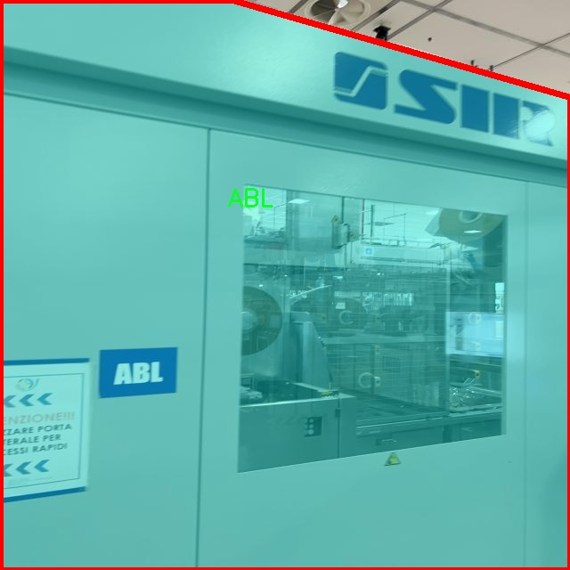
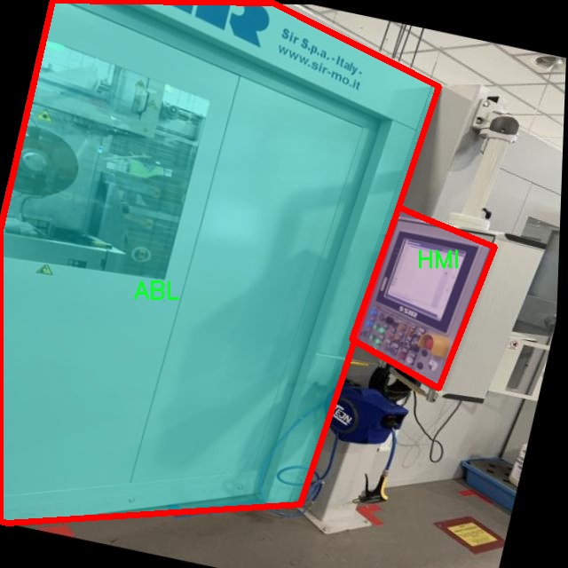
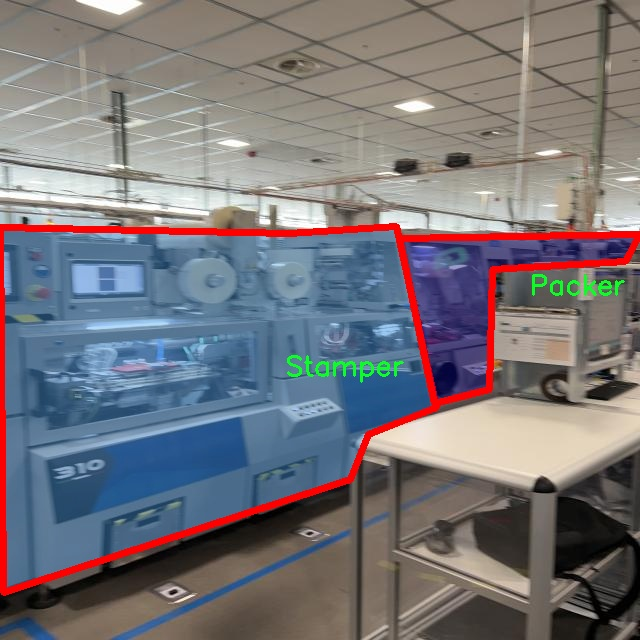
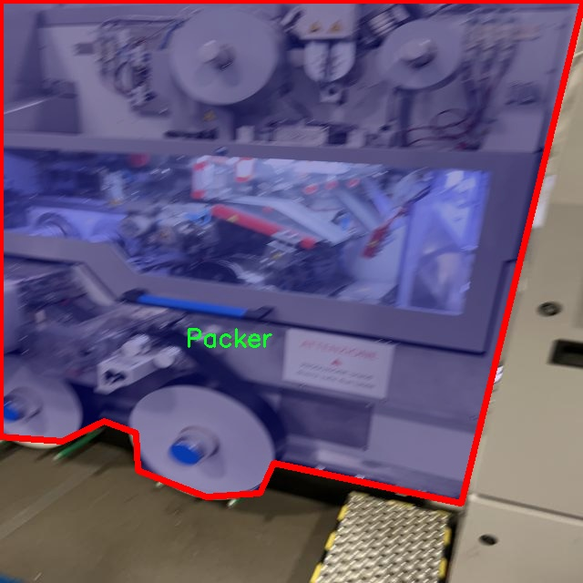
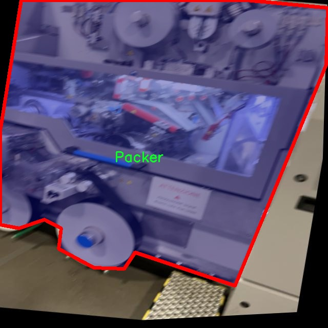

# 机器部件分割系统源码＆数据集分享
 [yolov8-seg-LAWDS＆yolov8-seg-RCSOSA等50+全套改进创新点发刊_一键训练教程_Web前端展示]

### 1.研究背景与意义

项目参考[ILSVRC ImageNet Large Scale Visual Recognition Challenge](https://gitee.com/YOLOv8_YOLOv11_Segmentation_Studio/projects)

项目来源[AAAI Global Al lnnovation Contest](https://kdocs.cn/l/cszuIiCKVNis)

研究背景与意义

随着工业自动化和智能制造的快速发展，机器视觉技术在生产线上的应用愈发广泛。机器部件的精确识别与分割是实现智能化生产的重要基础，尤其是在复杂的生产环境中，如何高效、准确地识别和分割不同类型的机器部件，成为了一个亟待解决的技术难题。传统的图像处理方法在处理复杂背景和多样化部件时，往往面临着识别率低、分割效果差等问题。因此，基于深度学习的实例分割技术逐渐成为研究的热点，其中YOLO（You Only Look Once）系列算法因其高效性和实时性而受到广泛关注。

YOLOv8作为YOLO系列的最新版本，结合了多种先进的深度学习技术，具有更强的特征提取能力和更高的检测精度。然而，针对特定领域的应用，YOLOv8的标准模型可能无法满足所有需求。因此，针对机器部件的特点，对YOLOv8进行改进，以提升其在机器部件分割任务中的表现，具有重要的研究意义。

本研究将利用一个包含1700张图像和15个类别的机器部件数据集，进行YOLOv8的改进与应用。该数据集涵盖了多种机器部件，如ABL、CU、Cartoner、Case等，具有较高的多样性和复杂性。这些部件在实际生产中具有不同的形状、颜色和纹理特征，且在图像中可能会出现重叠、遮挡等情况。因此，针对这些特征进行改进，将有助于提升YOLOv8在实例分割任务中的准确性和鲁棒性。

在此背景下，本研究的意义不仅在于提升机器部件的分割精度，更在于推动智能制造领域的技术进步。通过对YOLOv8的改进，我们可以实现对机器部件的快速、准确识别，为后续的自动化控制、故障检测和维护提供数据支持。同时，改进后的模型也可以为其他领域的实例分割任务提供借鉴，具有较强的推广价值。

此外，研究结果将为工业界提供一种高效的解决方案，帮助企业在生产过程中实现更高的自动化水平，降低人工成本，提高生产效率。在当前全球制造业竞争日益激烈的背景下，采用先进的机器视觉技术将为企业提供重要的竞争优势。因此，本研究不仅具有学术价值，更具备显著的实际应用前景。

综上所述，基于改进YOLOv8的机器部件分割系统的研究，既是对现有技术的深入探索，也是对智能制造未来发展的积极推动。通过对数据集的深入分析与模型的优化，我们期望能够在实例分割领域取得突破性进展，为工业自动化提供强有力的技术支持。

### 2.图片演示







##### 注意：由于此博客编辑较早，上面“2.图片演示”和“3.视频演示”展示的系统图片或者视频可能为老版本，新版本在老版本的基础上升级如下：（实际效果以升级的新版本为准）

  （1）适配了YOLOV8的“目标检测”模型和“实例分割”模型，通过加载相应的权重（.pt）文件即可自适应加载模型。

  （2）支持“图片识别”、“视频识别”、“摄像头实时识别”三种识别模式。

  （3）支持“图片识别”、“视频识别”、“摄像头实时识别”三种识别结果保存导出，解决手动导出（容易卡顿出现爆内存）存在的问题，识别完自动保存结果并导出到tempDir中。

  （4）支持Web前端系统中的标题、背景图等自定义修改，后面提供修改教程。

  另外本项目提供训练的数据集和训练教程,暂不提供权重文件（best.pt）,需要您按照教程进行训练后实现图片演示和Web前端界面演示的效果。

### 3.视频演示

[3.1 视频演示](https://www.bilibili.com/video/BV16B1PYYE6i/)

### 4.数据集信息展示

##### 4.1 本项目数据集详细数据（类别数＆类别名）

nc: 14
names: ['ABL', 'CU', 'Cartoner', 'Case', 'HMI', 'KTF', 'Modulo 2', 'Modulo 3', 'Modulo Flusso', 'Modulo di uscita', 'Modulo-1', 'Modulo-filtri', 'Packer', 'Stamper']


##### 4.2 本项目数据集信息介绍

数据集信息展示

在现代工业自动化的背景下，机器部件的精确识别与分割成为了提高生产效率和产品质量的关键因素。为此，我们构建了一个名为“Machine”的数据集，旨在为改进YOLOv8-seg的机器部件分割系统提供高质量的训练数据。该数据集包含14个不同的类别，涵盖了多种工业机器部件，具体类别包括：ABL、CU、Cartoner、Case、HMI、KTF、Modulo 2、Modulo 3、Modulo Flusso、Modulo di uscita、Modulo-1、Modulo-filtri、Packer和Stamper。这些类别的选择不仅反映了当前工业生产中常见的机器部件类型，也为算法的训练提供了丰富的样本，确保其在实际应用中的广泛适用性。

“Machine”数据集的构建过程注重数据的多样性和代表性。每个类别的样本均来自于真实的工业环境，涵盖了不同的工作条件和操作状态。这种多样性使得模型在训练过程中能够学习到更为复杂的特征，从而提高其在实际应用中的泛化能力。例如，ABL和CU作为机器的基础组件，其外观和功能在不同的机器上可能会有所差异，因此在数据集中，我们收集了多种型号和配置的样本，以确保模型能够适应这些变化。

此外，数据集中的每个类别都经过精心标注，确保了分割任务的准确性。我们采用了高精度的标注工具，对每个部件进行了细致的分割，确保模型在训练时能够获取到清晰的边界信息。这种精确的标注不仅提高了模型的训练效果，也为后续的验证和测试提供了可靠的依据。

在数据集的规模方面，我们确保了每个类别都有足够的样本量，以支持深度学习模型的训练需求。数据集中的样本数量经过精心设计，既保证了数据的丰富性，又避免了过拟合的风险。通过合理的数据增强技术，我们进一步扩展了数据集的多样性，增加了样本的变换、旋转、缩放等多种情况，以提高模型的鲁棒性。

为了便于研究人员和开发者使用，我们将“Machine”数据集的结构进行了标准化，确保其与现有的深度学习框架兼容。数据集的格式清晰明了，便于快速加载和处理，极大地降低了使用门槛。此外，我们还提供了详细的文档，指导用户如何有效地利用该数据集进行模型训练和评估。

总之，“Machine”数据集不仅为改进YOLOv8-seg的机器部件分割系统提供了坚实的基础，也为相关领域的研究者和工程师提供了宝贵的资源。通过对该数据集的深入研究与应用，我们期望能够推动机器视觉技术在工业自动化中的进一步发展，提升生产效率，降低人工成本，为未来的智能制造奠定基础。











### 5.全套项目环境部署视频教程（零基础手把手教学）

[5.1 环境部署教程链接（零基础手把手教学）](https://www.bilibili.com/video/BV1jG4Ve4E9t/?vd_source=bc9aec86d164b67a7004b996143742dc)


[5.2 安装Python虚拟环境创建和依赖库安装视频教程链接（零基础手把手教学）](https://www.bilibili.com/video/BV1nA4VeYEze/?vd_source=bc9aec86d164b67a7004b996143742dc)

### 6.手把手YOLOV8-seg训练视频教程（零基础小白有手就能学会）

[6.1 手把手YOLOV8-seg训练视频教程（零基础小白有手就能学会）](https://www.bilibili.com/video/BV1cA4VeYETe/?vd_source=bc9aec86d164b67a7004b996143742dc)


按照上面的训练视频教程链接加载项目提供的数据集，运行train.py即可开始训练



     Epoch   gpu_mem       box       obj       cls    labels  img_size
     1/200     0G   0.01576   0.01955  0.007536        22      1280: 100%|██████████| 849/849 [14:42<00:00,  1.04s/it]
               Class     Images     Labels          P          R     mAP@.5 mAP@.5:.95: 100%|██████████| 213/213 [01:14<00:00,  2.87it/s]
                 all       3395      17314      0.994      0.957      0.0957      0.0843

     Epoch   gpu_mem       box       obj       cls    labels  img_size
     2/200     0G   0.01578   0.01923  0.007006        22      1280: 100%|██████████| 849/849 [14:44<00:00,  1.04s/it]
               Class     Images     Labels          P          R     mAP@.5 mAP@.5:.95: 100%|██████████| 213/213 [01:12<00:00,  2.95it/s]
                 all       3395      17314      0.996      0.956      0.0957      0.0845

     Epoch   gpu_mem       box       obj       cls    labels  img_size
     3/200     0G   0.01561    0.0191  0.006895        27      1280: 100%|██████████| 849/849 [10:56<00:00,  1.29it/s]
               Class     Images     Labels          P          R     mAP@.5 mAP@.5:.95: 100%|███████   | 187/213 [00:52<00:00,  4.04it/s]
                 all       3395      17314      0.996      0.957      0.0957      0.0845


### 7.50+种全套YOLOV8-seg创新点代码加载调参视频教程（一键加载写好的改进模型的配置文件）

[7.1 50+种全套YOLOV8-seg创新点代码加载调参视频教程（一键加载写好的改进模型的配置文件）](https://www.bilibili.com/video/BV1Hw4VePEXv/?vd_source=bc9aec86d164b67a7004b996143742dc)

### 8.YOLOV8-seg图像分割算法原理

原始YOLOV8-seg算法原理

YOLOv8-seg算法是Ultralytics公司在2023年推出的YOLO系列的最新版本，代表了目标检测和图像分割领域的重大进步。作为YOLO系列的一部分，YOLOv8-seg不仅继承了以往版本的优点，还在结构和功能上进行了创新和优化，使其在处理复杂的视觉任务时表现得更加出色。该算法的核心思想是通过高效的特征提取和融合机制，结合Anchor-Free的检测方式，实现快速而准确的目标检测与分割。

首先，YOLOv8-seg的输入模块设计考虑到了图像的多样性和复杂性。默认情况下，输入图像的尺寸为640x640，但在实际应用中，图像的长宽比往往各不相同。为了解决这一问题，YOLOv8-seg采用了自适应图片缩放的策略。在推理阶段，算法将图像的长边按比例缩小到指定尺寸，然后对短边进行填充。这种处理方式有效减少了信息冗余，确保了目标的完整性和准确性。此外，在训练过程中，YOLOv8-seg引入了Mosaic增强技术，通过随机选择四张图像进行缩放和拼接，生成新的训练样本。这一过程不仅增加了数据的多样性，还迫使模型学习到不同位置和周围像素的特征，从而提升了模型的泛化能力和预测精度。

在特征提取方面，YOLOv8-seg的主干网络采用了CSP结构，并使用C2f模块替代了YOLOv5中的C3模块。C2f模块通过并行的梯度流分支，能够在保持轻量化的同时，提取到更加丰富的特征信息。这种设计使得YOLOv8-seg在处理不同尺度的目标时，能够有效捕捉到细节信息，提升了模型的检测精度。主干网络的输出特征经过SPPF模块的处理，利用不同内核尺寸的池化操作进行合并，进一步增强了特征图的表达能力。

在特征融合阶段，YOLOv8-seg采用了PAN-FPN（路径聚合网络）结构，结合了特征金字塔的优势，促进了语义特征和定位特征的有效转移。这一设计使得网络能够在不同尺度上获取更丰富的特征信息，从而增强了对多尺度目标的检测能力。通过这种多层次的特征融合，YOLOv8-seg能够在复杂场景中更好地识别和分割目标，尤其是在目标之间存在重叠或遮挡的情况下，表现得尤为突出。

YOLOv8-seg的检测模块采用了全新的解耦头结构，这一设计使得检测和分类的任务能够独立进行。具体而言，输入的特征图首先通过两个1x1的卷积模块进行降维处理，然后分别进入两个分支：一个用于类别预测，另一个用于边界框位置和IoU（交并比）预测。这种解耦的方式不仅提高了模型的训练效率，还减少了任务之间的干扰，使得模型在学习过程中能够更加专注于各自的目标。

在损失函数的设计上，YOLOv8-seg针对训练和推理过程中的逻辑不一致性进行了优化。具体而言，模型在分类分支中使用了二值交叉熵损失（BCELoss），而在边界框回归分支中则采用了分布焦点损失（DFL）和CIoULoss的组合。这一组合旨在使网络快速聚焦于标签附近的数值，从而提高模型的收敛速度和预测精度。

值得一提的是，YOLOv8-seg摒弃了传统的Anchor-Based检测方法，转而采用Anchor-Free的方式进行目标检测。这一转变使得模型在训练之前不再需要对数据集进行锚框的聚类和设置，简化了模型的设计和实现。同时，Anchor-Free方法提高了模型的泛化能力，使其在处理不同类型的目标时更加灵活和高效。

综上所述，YOLOv8-seg算法通过一系列创新的设计和优化，不仅提升了目标检测和图像分割的精度和速度，还增强了模型的适应性和灵活性。其独特的输入处理、特征提取、特征融合和检测模块的设计，使得YOLOv8-seg在实际应用中展现出强大的性能，成为目标检测和图像分割领域的重要工具。随着YOLOv8-seg的不断发展和应用，其在更多复杂场景中的表现值得期待。


### 9.系统功能展示（检测对象为举例，实际内容以本项目数据集为准）

图9.1.系统支持检测结果表格显示

  图9.2.系统支持置信度和IOU阈值手动调节

  图9.3.系统支持自定义加载权重文件best.pt(需要你通过步骤5中训练获得)

  图9.4.系统支持摄像头实时识别

  图9.5.系统支持图片识别

  图9.6.系统支持视频识别

  图9.7.系统支持识别结果文件自动保存

  图9.8.系统支持Excel导出检测结果数据


### 10.50+种全套YOLOV8-seg创新点原理讲解（非科班也可以轻松写刊发刊，V11版本正在科研待更新）

#### 10.1 由于篇幅限制，每个创新点的具体原理讲解就不一一展开，具体见下列网址中的创新点对应子项目的技术原理博客网址【Blog】：


[10.1 50+种全套YOLOV8-seg创新点原理讲解链接](https://gitee.com/qunmasj/good)

#### 10.2 部分改进模块原理讲解(完整的改进原理见上图和技术博客链接)【如果此小节的图加载失败可以通过CSDN或者Github搜索该博客的标题访问原始博客，原始博客图片显示正常】
### 可变性卷积DCN简介
卷积神经网络由于其构建模块中固定的几何结构，本质上受限于模型几何变换。为了提高卷积神经网络的转换建模能力，《Deformable Convolutional Networks》作者提出了两个模块：可变形卷积（deformable convolution）和可变形RoI池（deformable RoI pooling）。这两个模块均基于用额外的偏移来增加模块中的空间采样位置以及从目标任务中学习偏移的思想，而不需要额外的监督。

第一次证明了在深度神经网络中学习密集空间变换（dense spatial transformation）对于复杂的视觉任务是有效的

视觉识别中的一个关键挑战是如何适应对象比例、姿态、视点和零件变形中的几何变化或模型几何变换。一般有两种方法实现：
1）建立具有足够期望变化的训练数据集。这通常通过增加现有的数据样本来实现，例如通过仿射变换。但是训练成本昂贵而且模型参数庞大。
2）使用变换不变（transformation-invariant）的特征和算法。比如比较有名的SIFT(尺度不变特征变换)便是这一类的代表算法。

但以上的方法有两个缺点：
1）几何变换被假定为固定的和已知的，这些先验知识被用来扩充数据，设计特征和算法。为此，这个假设阻止了对具有未知几何变换的新任务的推广，从而导致这些几何变换可能没有被正确建模。
2）对于不变特征和算法进行手动设计，对于过于复杂的变换可能是困难的或不可行的。

卷积神经网络本质上局限于模拟大型未知转换。局限性源于CNN模块的固定几何结构：卷积单元在固定位置对输入特征图进行采样；池化层以固定比率降低特征矩阵分辨率；RoI（感兴趣区域）池化层将RoI分成固定的空间箱（spatial bins）等。缺乏处理几何变换的内部机制。

这种内部机制的缺乏会导致一些问题，举个例子。同一个CNN层中所有激活单元的感受野大小是相同的，但是这是不可取的。因为不同的位置可能对应于具有不同尺度或变形的对象，所以尺度或感受野大小的自适应确定对于具有精细定位的视觉识别是渴望的。

对于这些问题，作者提出了两个模块提高CNNs对几何变换建模的能力。


deformable convolution（可变形卷积）
将2D偏移量添加到标准卷积中的常规网格采样位置，使得采样网格能够自由变形。通过额外的卷积层，从前面的特征映射中学习偏移。因此，变形采用局部、密集和自适应的方式取决于输入特征。


deformable RoI pooling（可变形RoI池化）
为先前RoI池化的常规库（bin）分区中的每个库位置（bin partition）增加了一个偏移量。类似地，偏移是从前面的特征图和感兴趣区域中学习的，从而能够对具有不同形状的对象进行自适应部件定位（adaptive part localization）。

#### Deformable Convolutional Networks
Deformable Convolution
2D卷积由两个步骤组成：
1）在输入特征图x xx上使用规则网格R RR进行采样。
2）把这些采样点乘不同权重w ww后相加。

网格R定义感受野大小和扩张程度，比如内核大小为3x3，扩张程度为1的网格R可以表示为：
R = { ( − 1 , − 1 ) , ( − 1 , 0 ) , … , ( 0 , 1 ) , ( 1 , 1 ) } R = \{(-1,-1),(-1,0),\dots,(0,1),(1,1)\}
R={(−1,−1),(−1,0),…,(0,1),(1,1)}

​
 一般为小数，使用双线性插值进行处理。（把小数坐标分解到相邻的四个整数坐标点来计算结果）


具体操作如图所示：


首先对输入特征层进行一个普通的3x3卷积处理得到偏移域（offset field）。偏移域特征图具有与输入特征图相同的空间分辨率，channels维度2N对应于N个2D（xy两个方向）偏移。其中的N是原输入特征图上所具有的N个channels，也就是输入输出channels保持不变，这里xy两个channels分别对输出特征图上的一个channels进行偏移。确定采样点后就通过与相对应的权重w点乘相加得到输出特征图上该点最终值。

前面也提到过，由于这里xy两个方向所训练出来的偏移量一般来说是一个小数，那么为了得到这个点所对应的数值，会采用双线性插值的方法，从最近的四个邻近坐标点中计算得到该偏移点的数值，公式如下：


具体推理过程见：双线性插值原理

#### Deformable RoI Poolingb
所有基于区域提议（RPN）的对象检测方法都使用RoI池话处理，将任意大小的输入矩形区域转换为固定大小的特征图。


 一般为小数，需要使用双线性插值进行处理。


具体操作如图所示：


当时看这个部分的时候觉得有些突兀，明明RoI池化会将特征层转化为固定尺寸的区域。其实，我个人觉得，这个部分与上述的可变性卷积操作是类似的。这里同样是使用了一个普通的RoI池化操作，进行一些列处理后得到了一个偏移域特征图，然后重新作用于原来的w × H w \times Hw×H的RoI。只不过这里不再是规律的逐行逐列对每个格子进行池化，而是对于格子进行偏移后再池化处理。

#### Postion﹣Sensitive RoI Pooling
除此之外，论文还提出一种PS RoI池化（Postion﹣Sensitive RoI Pooling）。不同于上述可变形RoI池化中的全连接过程，这里使用全卷积替换。

具体操作如图所示：


首先，对于原来的特征图来说，原本是将输入特征图上的RoI区域分成k × k k\times kk×k个bin。而在这里，则是将输入特征图进行卷积操作，分别得到一个channels为k 2 ( C + 1 ) k^{2}(C+1)k (C+1)的得分图（score maps）和一个channels为2 k 2 ( C + 1 ) 2k{2}(C+1)2k 2 (C+1)的偏移域（offset fields），这两个特征矩阵的宽高是与输入特征矩阵相同的。其中，得分图的channels中，k × k k \times kk×k分别表示的是每一个网格，C CC表示的检测对象的类别数目，1表示背景。而在偏移域中的2表示xy两个方向的偏移。
也就是说，在PS RoI池化中，对于RoI的每一个网格都独自占一个通道形成一层得分图，然后其对于的偏移量占两个通道。offset fields得到的偏移是归一化后的偏移，需要通过和deformable RoI pooling中一样的变换方式得到∆ p i j ∆p_{ij}∆p ij，然后对每层得分图进行偏移池化处理。最后处理完的结果就对应着最后输出的一个网格。所以其包含了位置信息。

原文论述为：


#### Understanding Deformable ConvNets
当可变形卷积叠加时，复合变形的效果是深远的。如图所示：


ps：a是标准卷积的固定感受野，b是可变形卷积的适应性感受野。

感受野和标准卷积中的采样位置在整个顶部特征图上是固定的(左)。在可变形卷积中，它们根据对象的比例和形状进行自适应调整(右)。


### 11.项目核心源码讲解（再也不用担心看不懂代码逻辑）

#### 11.1 ultralytics\utils\patches.py

以下是对给定代码的核心部分进行分析和详细注释的结果：

```python
# 导入必要的库
from pathlib import Path
import cv2
import numpy as np
import torch

# OpenCV 多语言友好的函数 ------------------------------------------------------------------------------

def imread(filename: str, flags: int = cv2.IMREAD_COLOR):
    """
    从文件中读取图像。

    参数:
        filename (str): 要读取的文件路径。
        flags (int, optional): 标志，可以取 cv2.IMREAD_* 的值。默认为 cv2.IMREAD_COLOR。

    返回:
        (np.ndarray): 读取的图像。
    """
    # 使用 cv2.imdecode 从文件中读取图像，支持多语言文件路径
    return cv2.imdecode(np.fromfile(filename, np.uint8), flags)


def imwrite(filename: str, img: np.ndarray, params=None):
    """
    将图像写入文件。

    参数:
        filename (str): 要写入的文件路径。
        img (np.ndarray): 要写入的图像。
        params (list of ints, optional): 额外参数。参见 OpenCV 文档。

    返回:
        (bool): 如果文件写入成功返回 True，否则返回 False。
    """
    try:
        # 使用 cv2.imencode 将图像编码并写入文件，支持多语言文件路径
        cv2.imencode(Path(filename).suffix, img, params)[1].tofile(filename)
        return True
    except Exception:
        return False


def imshow(winname: str, mat: np.ndarray):
    """
    在指定窗口中显示图像。

    参数:
        winname (str): 窗口的名称。
        mat (np.ndarray): 要显示的图像。
    """
    # 使用 OpenCV 的 imshow 函数显示图像，处理窗口名称的编码
    cv2.imshow(winname.encode('unicode_escape').decode(), mat)


# PyTorch 函数 ----------------------------------------------------------------------------------------------------

def torch_save(*args, **kwargs):
    """
    使用 dill（如果存在）序列化 lambda 函数，因为 pickle 无法处理这些函数。

    参数:
        *args (tuple): 传递给 torch.save 的位置参数。
        **kwargs (dict): 传递给 torch.save 的关键字参数。
    """
    try:
        import dill as pickle  # 尝试导入 dill 模块
    except ImportError:
        import pickle  # 如果没有 dill，则使用 pickle

    # 如果没有指定 pickle_module，则使用导入的 pickle
    if 'pickle_module' not in kwargs:
        kwargs['pickle_module'] = pickle  # 设置 pickle_module
    return torch.save(*args, **kwargs)  # 调用原始的 torch.save 函数
```

### 代码分析

1. **imread**: 该函数用于从文件中读取图像，支持多语言文件路径。它使用 `cv2.imdecode` 读取图像数据并返回为 NumPy 数组。

2. **imwrite**: 该函数将图像写入指定的文件，支持多语言文件路径。它使用 `cv2.imencode` 编码图像并将其写入文件，返回写入成功与否的布尔值。

3. **imshow**: 该函数用于在指定窗口中显示图像。它处理窗口名称的编码，以确保在不同语言环境下的兼容性。

4. **torch_save**: 该函数扩展了 PyTorch 的 `torch.save` 功能，支持序列化 lambda 函数。它尝试使用 `dill` 模块，如果没有则使用 `pickle`，并将序列化模块传递给 `torch.save`。

这些函数是图像处理和模型保存的核心功能，适用于计算机视觉和深度学习的应用场景。

这个文件 `ultralytics/utils/patches.py` 是一个用于扩展和更新现有功能的猴子补丁（monkey patches），主要涉及图像处理和模型保存的功能。文件中导入了必要的库，包括 `cv2`（OpenCV）、`numpy` 和 `torch`（PyTorch），并对一些函数进行了重新定义，以增强其功能或解决潜在的问题。

首先，文件定义了一个名为 `imread` 的函数，用于从文件中读取图像。该函数接受两个参数：文件名和读取标志，默认情况下使用 `cv2.IMREAD_COLOR` 读取彩色图像。通过 `cv2.imdecode` 和 `np.fromfile`，该函数能够读取指定路径的图像文件，并返回一个 NumPy 数组表示的图像。

接下来是 `imwrite` 函数，它用于将图像写入文件。该函数接受文件名、图像数组和可选的参数列表。使用 `cv2.imencode` 将图像编码为指定格式，并通过 `tofile` 方法将其写入文件。函数在写入过程中进行了异常处理，如果写入成功返回 `True`，否则返回 `False`。

然后是 `imshow` 函数，用于在指定窗口中显示图像。该函数接受窗口名称和图像数组作为参数。为了避免递归错误，函数使用了 `_imshow` 变量来调用 OpenCV 的 `imshow` 函数，并在调用时对窗口名称进行了编码处理，以确保其能够正确显示。

最后，文件中还定义了一个 `torch_save` 函数，用于保存 PyTorch 模型。这个函数的主要目的是使用 `dill` 模块（如果存在）来序列化那些 `pickle` 无法处理的 lambda 函数。函数接受任意数量的位置参数和关键字参数，并在没有指定 `pickle_module` 的情况下，默认使用 `dill` 或 `pickle` 进行序列化。

总体而言，这个文件通过对 OpenCV 和 PyTorch 的一些函数进行封装和扩展，提供了更灵活和安全的图像处理及模型保存功能，旨在提高代码的可用性和稳定性。

#### 11.2 ui.py

```python
import sys
import subprocess

def run_script(script_path):
    """
    使用当前 Python 环境运行指定的脚本。

    Args:
        script_path (str): 要运行的脚本路径

    Returns:
        None
    """
    # 获取当前 Python 解释器的路径
    python_path = sys.executable

    # 构建运行命令
    command = f'"{python_path}" -m streamlit run "{script_path}"'

    # 执行命令
    result = subprocess.run(command, shell=True)
    if result.returncode != 0:
        print("脚本运行出错。")


# 实例化并运行应用
if __name__ == "__main__":
    # 指定您的脚本路径
    script_path = "web.py"  # 这里可以直接指定脚本路径

    # 运行脚本
    run_script(script_path)
```

### 代码核心部分及注释

1. **导入模块**：
   ```python
   import sys
   import subprocess
   ```
   - `sys`模块用于访问与Python解释器紧密相关的变量和函数，这里用来获取当前Python解释器的路径。
   - `subprocess`模块用于执行外部命令，这里用来运行指定的Python脚本。

2. **定义函数 `run_script`**：
   ```python
   def run_script(script_path):
   ```
   - 该函数接收一个参数 `script_path`，表示要运行的Python脚本的路径。

3. **获取当前Python解释器路径**：
   ```python
   python_path = sys.executable
   ```
   - 使用 `sys.executable` 获取当前Python解释器的完整路径，以便后续调用。

4. **构建运行命令**：
   ```python
   command = f'"{python_path}" -m streamlit run "{script_path}"'
   ```
   - 使用格式化字符串构建命令，调用 `streamlit` 模块来运行指定的脚本。

5. **执行命令**：
   ```python
   result = subprocess.run(command, shell=True)
   ```
   - 使用 `subprocess.run` 执行构建的命令，`shell=True` 允许在shell中执行命令。

6. **检查执行结果**：
   ```python
   if result.returncode != 0:
       print("脚本运行出错。")
   ```
   - 检查命令的返回码，如果不为0，表示脚本运行出错，打印错误信息。

7. **主程序入口**：
   ```python
   if __name__ == "__main__":
   ```
   - 该部分确保只有在直接运行该脚本时才会执行以下代码。

8. **指定脚本路径并运行**：
   ```python
   script_path = "web.py"  # 这里可以直接指定脚本路径
   run_script(script_path)
   ```
   - 指定要运行的脚本路径，并调用 `run_script` 函数执行该脚本。

这个程序文件的主要功能是通过当前的 Python 环境来运行一个指定的脚本，具体来说是一个名为 `web.py` 的脚本。程序首先导入了必要的模块，包括 `sys`、`os` 和 `subprocess`，以及一个自定义的 `abs_path` 函数，用于获取脚本的绝对路径。

在 `run_script` 函数中，首先获取当前 Python 解释器的路径，这样可以确保在正确的环境中运行脚本。接着，构建一个命令字符串，这个命令使用 `streamlit` 模块来运行指定的脚本。`streamlit` 是一个用于构建数据应用的库，通常用于快速创建和分享数据应用。

随后，使用 `subprocess.run` 方法执行构建好的命令。这个方法会在一个新的进程中运行命令，并等待其完成。如果脚本运行出现错误（即返回码不为0），程序会打印出“脚本运行出错”的提示。

在文件的最后部分，使用 `if __name__ == "__main__":` 语句来确保只有在直接运行该文件时才会执行后面的代码。这里指定了要运行的脚本路径，即 `web.py`，并调用 `run_script` 函数来执行这个脚本。

总的来说，这个程序的设计目的是为了方便地在指定的 Python 环境中运行一个 Streamlit 应用脚本，确保用户能够轻松启动他们的应用。

#### 11.3 ultralytics\models\yolo\pose\train.py

以下是代码中最核心的部分，并附上详细的中文注释：

```python
# 导入必要的库和模块
from copy import copy
from ultralytics.models import yolo
from ultralytics.nn.tasks import PoseModel
from ultralytics.utils import DEFAULT_CFG, LOGGER
from ultralytics.utils.plotting import plot_images, plot_results

class PoseTrainer(yolo.detect.DetectionTrainer):
    """
    PoseTrainer类，扩展了DetectionTrainer类，用于基于姿态模型的训练。
    """

    def __init__(self, cfg=DEFAULT_CFG, overrides=None, _callbacks=None):
        """初始化PoseTrainer对象，指定配置和覆盖参数。"""
        if overrides is None:
            overrides = {}
        overrides['task'] = 'pose'  # 设置任务类型为姿态估计
        super().__init__(cfg, overrides, _callbacks)  # 调用父类构造函数

        # 检查设备类型，如果是Apple MPS，给出警告
        if isinstance(self.args.device, str) and self.args.device.lower() == 'mps':
            LOGGER.warning("WARNING ⚠️ Apple MPS known Pose bug. Recommend 'device=cpu' for Pose models. "
                           'See https://github.com/ultralytics/ultralytics/issues/4031.')

    def get_model(self, cfg=None, weights=None, verbose=True):
        """获取指定配置和权重的姿态估计模型。"""
        # 创建PoseModel实例
        model = PoseModel(cfg, ch=3, nc=self.data['nc'], data_kpt_shape=self.data['kpt_shape'], verbose=verbose)
        if weights:
            model.load(weights)  # 如果提供权重，则加载权重

        return model  # 返回模型实例

    def set_model_attributes(self):
        """设置PoseModel的关键点形状属性。"""
        super().set_model_attributes()  # 调用父类的方法
        self.model.kpt_shape = self.data['kpt_shape']  # 设置关键点形状

    def get_validator(self):
        """返回PoseValidator类的实例，用于验证。"""
        self.loss_names = 'box_loss', 'pose_loss', 'kobj_loss', 'cls_loss', 'dfl_loss'  # 定义损失名称
        return yolo.pose.PoseValidator(self.test_loader, save_dir=self.save_dir, args=copy(self.args))  # 返回验证器实例

    def plot_training_samples(self, batch, ni):
        """绘制一批训练样本，包括标注的类别标签、边界框和关键点。"""
        images = batch['img']  # 获取图像
        kpts = batch['keypoints']  # 获取关键点
        cls = batch['cls'].squeeze(-1)  # 获取类别
        bboxes = batch['bboxes']  # 获取边界框
        paths = batch['im_file']  # 获取图像文件路径
        batch_idx = batch['batch_idx']  # 获取批次索引
        # 绘制图像并保存
        plot_images(images,
                    batch_idx,
                    cls,
                    bboxes,
                    kpts=kpts,
                    paths=paths,
                    fname=self.save_dir / f'train_batch{ni}.jpg',
                    on_plot=self.on_plot)

    def plot_metrics(self):
        """绘制训练和验证的指标。"""
        plot_results(file=self.csv, pose=True, on_plot=self.on_plot)  # 保存结果图像
```

### 代码核心部分说明：
1. **PoseTrainer类**：该类继承自`DetectionTrainer`，用于实现姿态估计的训练。
2. **初始化方法**：设置任务类型为姿态估计，并处理设备类型的警告。
3. **获取模型**：创建并返回姿态估计模型，支持加载预训练权重。
4. **设置模型属性**：设置模型的关键点形状属性。
5. **获取验证器**：返回用于验证的PoseValidator实例，并定义损失名称。
6. **绘制训练样本**：将一批训练样本绘制成图像，包含类别标签、边界框和关键点，并保存图像。
7. **绘制指标**：绘制训练和验证过程中的指标，并保存结果图像。

这个程序文件是一个用于训练姿态估计模型的类，名为 `PoseTrainer`，它继承自 `yolo.detect.DetectionTrainer`。该类的主要功能是配置和管理姿态模型的训练过程。

在文件开头，导入了一些必要的模块和类，包括 `yolo` 模块、`PoseModel` 类以及一些工具函数，如 `plot_images` 和 `plot_results`。这些导入为后续的模型训练和结果可视化提供了支持。

`PoseTrainer` 类的构造函数 `__init__` 接受配置参数 `cfg`、覆盖参数 `overrides` 和回调 `_callbacks`。如果没有提供覆盖参数，则默认初始化为空字典。然后，将任务类型设置为 'pose'，并调用父类的构造函数进行初始化。此外，如果设备被设置为 'mps'（苹果的金属图形API），则会发出警告，建议使用 'cpu' 设备来避免已知的姿态模型问题。

`get_model` 方法用于获取姿态估计模型。它根据提供的配置和权重初始化 `PoseModel`，并在有权重的情况下加载这些权重。返回的模型可以用于后续的训练和评估。

`set_model_attributes` 方法用于设置模型的关键点形状属性。它首先调用父类的方法，然后将关键点形状从数据集中提取并赋值给模型。

`get_validator` 方法返回一个 `PoseValidator` 实例，用于模型验证。它设置了损失名称，包括边界框损失、姿态损失、关键对象损失、类别损失和分布式焦点损失。

`plot_training_samples` 方法用于可视化一批训练样本。它接收一个批次的数据，包括图像、关键点、类别、边界框和文件路径，并调用 `plot_images` 函数将这些信息绘制到图像上，保存为指定的文件名。

最后，`plot_metrics` 方法用于绘制训练和验证的指标，调用 `plot_results` 函数生成结果图像并保存。

整体而言，这个文件实现了一个专门用于姿态估计的训练器，提供了模型初始化、训练样本可视化和训练指标绘制等功能，方便用户进行姿态估计模型的训练和评估。

#### 11.4 ultralytics\nn\modules\block.py

以下是代码中最核心的部分，并附上详细的中文注释：

```python
import torch
import torch.nn as nn
import torch.nn.functional as F

class DFL(nn.Module):
    """
    分布焦点损失（DFL）的核心模块。
    在Generalized Focal Loss中提出。
    """

    def __init__(self, c1=16):
        """初始化一个卷积层，输入通道数为c1。"""
        super().__init__()
        # 创建一个卷积层，输入通道为c1，输出通道为1，卷积核大小为1，不使用偏置
        self.conv = nn.Conv2d(c1, 1, 1, bias=False).requires_grad_(False)
        # 初始化卷积层的权重为一个范围为[0, c1)的张量
        x = torch.arange(c1, dtype=torch.float)
        self.conv.weight.data[:] = nn.Parameter(x.view(1, c1, 1, 1))
        self.c1 = c1  # 保存输入通道数

    def forward(self, x):
        """对输入张量'x'应用DFL模块并返回结果。"""
        b, c, a = x.shape  # 获取输入的批量大小、通道数和锚点数
        # 对输入进行变形并通过卷积层处理，最后返回形状为(b, 4, a)的张量
        return self.conv(x.view(b, 4, self.c1, a).transpose(2, 1).softmax(1)).view(b, 4, a)


class Proto(nn.Module):
    """YOLOv8掩膜原型模块，用于分割模型。"""

    def __init__(self, c1, c_=256, c2=32):
        """
        初始化YOLOv8掩膜原型模块，指定原型数和掩膜数。
        输入参数为输入通道数c1，原型数c_，掩膜数c2。
        """
        super().__init__()
        self.cv1 = Conv(c1, c_, k=3)  # 第一个卷积层
        self.upsample = nn.ConvTranspose2d(c_, c_, 2, 2, 0, bias=True)  # 上采样层
        self.cv2 = Conv(c_, c_, k=3)  # 第二个卷积层
        self.cv3 = Conv(c_, c2)  # 第三个卷积层

    def forward(self, x):
        """通过上采样和卷积层进行前向传播。"""
        return self.cv3(self.cv2(self.upsample(self.cv1(x))))


class HGStem(nn.Module):
    """
    PPHGNetV2的StemBlock，包含5个卷积层和一个最大池化层。
    """

    def __init__(self, c1, cm, c2):
        """初始化StemBlock，指定输入输出通道。"""
        super().__init__()
        self.stem1 = Conv(c1, cm, 3, 2)  # 第一个卷积层
        self.stem2a = Conv(cm, cm // 2, 2, 1, 0)  # 第二个卷积层
        self.stem2b = Conv(cm // 2, cm, 2, 1, 0)  # 第三个卷积层
        self.stem3 = Conv(cm * 2, cm, 3, 2)  # 第四个卷积层
        self.stem4 = Conv(cm, c2, 1, 1)  # 第五个卷积层
        self.pool = nn.MaxPool2d(kernel_size=2, stride=1, padding=0, ceil_mode=True)  # 最大池化层

    def forward(self, x):
        """PPHGNetV2的前向传播。"""
        x = self.stem1(x)  # 通过第一个卷积层
        x = F.pad(x, [0, 1, 0, 1])  # 对输出进行填充
        x2 = self.stem2a(x)  # 通过第二个卷积层
        x2 = F.pad(x2, [0, 1, 0, 1])  # 对输出进行填充
        x2 = self.stem2b(x2)  # 通过第三个卷积层
        x1 = self.pool(x)  # 通过最大池化层
        x = torch.cat([x1, x2], dim=1)  # 在通道维度上拼接
        x = self.stem3(x)  # 通过第四个卷积层
        x = self.stem4(x)  # 通过第五个卷积层
        return x  # 返回最终输出


class C3(nn.Module):
    """CSP Bottleneck模块，包含3个卷积层。"""

    def __init__(self, c1, c2, n=1, shortcut=True, g=1, e=0.5):
        """初始化CSP Bottleneck，指定输入输出通道、数量、shortcut、groups和扩展比例。"""
        super().__init__()
        c_ = int(c2 * e)  # 计算隐藏通道数
        self.cv1 = Conv(c1, c_, 1, 1)  # 第一个卷积层
        self.cv2 = Conv(c1, c_, 1, 1)  # 第二个卷积层
        self.cv3 = Conv(2 * c_, c2, 1)  # 第三个卷积层
        self.m = nn.Sequential(*(Bottleneck(c_, c_, shortcut, g, k=((1, 1), (3, 3)), e=1.0) for _ in range(n)))  # Bottleneck序列

    def forward(self, x):
        """通过CSP Bottleneck进行前向传播。"""
        return self.cv3(torch.cat((self.m(self.cv1(x)), self.cv2(x)), 1))  # 拼接并通过第三个卷积层


class Bottleneck(nn.Module):
    """标准的Bottleneck模块。"""

    def __init__(self, c1, c2, shortcut=True, g=1, k=(3, 3), e=0.5):
        """初始化Bottleneck模块，指定输入输出通道、shortcut选项、groups、kernels和扩展比例。"""
        super().__init__()
        c_ = int(c2 * e)  # 计算隐藏通道数
        self.cv1 = Conv(c1, c_, k[0], 1)  # 第一个卷积层
        self.cv2 = Conv(c_, c2, k[1], 1, g=g)  # 第二个卷积层
        self.add = shortcut and c1 == c2  # 判断是否使用shortcut

    def forward(self, x):
        """通过Bottleneck模块进行前向传播。"""
        return x + self.cv2(self.cv1(x)) if self.add else self.cv2(self.cv1(x))  # 如果使用shortcut，则加上输入


# 以上是核心模块的简化和注释，其他模块可以根据需要进行添加和注释。
```

以上代码展示了YOLO模型中的一些核心模块，包括分布焦点损失（DFL）、YOLOv8掩膜原型模块（Proto）、PPHGNetV2的StemBlock、CSP Bottleneck模块和标准Bottleneck模块。每个模块都包含初始化和前向传播的方法，并附有详细的中文注释以便理解其功能和结构。

这个程序文件是Ultralytics YOLO模型的一部分，主要定义了一些神经网络模块，这些模块在YOLO模型的不同层中使用。文件中包含了多个类，每个类实现了特定的功能，主要用于构建卷积神经网络的结构。

首先，文件导入了必要的PyTorch库，包括`torch`和`torch.nn`，以及一些自定义的卷积模块（如`Conv`、`DWConv`、`GhostConv`等）和变换模块（如`TransformerBlock`）。这些模块都是构建深度学习模型的基础组件。

接下来，文件定义了多个类，每个类都继承自`nn.Module`，这是PyTorch中所有神经网络模块的基类。以下是一些主要模块的功能：

1. **DFL（Distribution Focal Loss）**：这个模块实现了分布焦点损失的计算，主要用于处理类别不平衡的问题。它通过卷积层将输入张量转换为特定的输出格式。

2. **Proto**：这是YOLOv8的掩码原型模块，主要用于分割模型。它通过多个卷积层和上采样层来处理输入数据，生成掩码。

3. **HGStem**：这是PPHGNetV2的StemBlock，包含多个卷积层和一个最大池化层，用于提取特征。

4. **HGBlock**：实现了PPHGNetV2的HG_Block，包含多个卷积层，支持轻量卷积（LightConv）和快捷连接（shortcut）。

5. **SPP（Spatial Pyramid Pooling）**：实现了空间金字塔池化层，通过不同大小的池化操作来增强特征提取能力。

6. **C1、C2、C3等**：这些类实现了不同配置的CSP（Cross Stage Partial）瓶颈模块，分别支持1、2、3个卷积层的组合，旨在提高网络的表现力和效率。

7. **GhostBottleneck**：实现了Ghost瓶颈，旨在减少模型的计算量和参数量，同时保持较好的性能。

8. **Bottleneck和BottleneckCSP**：这两个类实现了标准的瓶颈结构和CSP瓶颈结构，分别用于构建更深层次的网络。

每个模块的`forward`方法定义了数据如何通过该模块进行前向传播，通常涉及到卷积、激活、池化等操作。通过这些模块的组合，YOLO模型能够有效地进行目标检测和分割任务。

总体而言，这个文件提供了YOLO模型中各个模块的实现细节，展现了如何通过组合不同的卷积和池化操作来构建复杂的神经网络结构。

#### 11.5 ultralytics\nn\extra_modules\ops_dcnv3\setup.py

以下是代码中最核心的部分，并附上详细的中文注释：

```python
import os
import glob
import torch
from torch.utils.cpp_extension import CUDA_HOME, CppExtension, CUDAExtension
from setuptools import find_packages, setup

# 定义所需的依赖包
requirements = ["torch", "torchvision"]

def get_extensions():
    # 获取当前文件的目录
    this_dir = os.path.dirname(os.path.abspath(__file__))
    # 定义扩展模块的源代码目录
    extensions_dir = os.path.join(this_dir, "src")

    # 获取主文件和CPU、CUDA源文件
    main_file = glob.glob(os.path.join(extensions_dir, "*.cpp"))
    source_cpu = glob.glob(os.path.join(extensions_dir, "cpu", "*.cpp"))
    source_cuda = glob.glob(os.path.join(extensions_dir, "cuda", "*.cu"))

    # 合并源文件
    sources = main_file + source_cpu
    extension = CppExtension  # 默认使用 CppExtension
    extra_compile_args = {"cxx": []}  # 额外的编译参数
    define_macros = []  # 定义的宏

    # 检查是否可以使用 CUDA
    if torch.cuda.is_available() and CUDA_HOME is not None:
        extension = CUDAExtension  # 使用 CUDAExtension
        sources += source_cuda  # 添加 CUDA 源文件
        define_macros += [("WITH_CUDA", None)]  # 定义 WITH_CUDA 宏
        extra_compile_args["nvcc"] = []  # 可以添加 nvcc 的编译参数
    else:
        raise NotImplementedError('Cuda is not available')  # 如果不支持 CUDA，抛出异常

    # 生成完整的源文件路径
    sources = [os.path.join(extensions_dir, s) for s in sources]
    include_dirs = [extensions_dir]  # 包含目录
    ext_modules = [
        extension(
            "DCNv3",  # 扩展模块的名称
            sources,  # 源文件列表
            include_dirs=include_dirs,  # 包含目录
            define_macros=define_macros,  # 定义的宏
            extra_compile_args=extra_compile_args,  # 额外的编译参数
        )
    ]
    return ext_modules  # 返回扩展模块列表

# 使用 setuptools 设置包的信息
setup(
    name="DCNv3",  # 包名
    version="1.1",  # 版本号
    author="InternImage",  # 作者
    url="https://github.com/OpenGVLab/InternImage",  # 项目链接
    description="PyTorch Wrapper for CUDA Functions of DCNv3",  # 描述
    packages=find_packages(exclude=("configs", "tests")),  # 查找包，排除 configs 和 tests 目录
    ext_modules=get_extensions(),  # 获取扩展模块
    cmdclass={"build_ext": torch.utils.cpp_extension.BuildExtension},  # 自定义构建命令
)
```

### 代码说明：
1. **导入必要的库**：导入了处理文件路径、CUDA扩展和设置包的相关库。
2. **定义依赖包**：列出了项目所需的主要依赖包。
3. **获取扩展模块**：`get_extensions` 函数负责查找源文件并根据是否支持 CUDA 来选择合适的扩展类型（`CppExtension` 或 `CUDAExtension`）。
4. **设置包信息**：使用 `setuptools` 的 `setup` 函数来定义包的名称、版本、作者、描述等信息，并指定扩展模块。

这个 `setup.py` 文件是用于构建和安装一个名为 `DCNv3` 的 Python 包，主要是为 PyTorch 提供 CUDA 函数的封装。文件开头包含了一些版权信息和许可证声明，表明该代码的版权归 OpenGVLab 所有，并且使用 MIT 许可证。

首先，文件导入了一些必要的模块，包括 `os` 和 `glob` 用于文件路径处理，`torch` 用于与 PyTorch 相关的操作，以及 `setuptools` 中的 `setup` 和 `find_packages` 函数用于包的构建和安装。

接下来，定义了一个 `requirements` 列表，列出了该包所依赖的其他 Python 包，这里包括 `torch` 和 `torchvision`。

`get_extensions` 函数用于获取需要编译的扩展模块。首先，它确定当前文件的目录，并构建源代码文件的路径。然后，使用 `glob` 模块查找指定目录下的 C++ 和 CUDA 源文件。主要的 C++ 文件、CPU 相关的 C++ 文件和 CUDA 相关的文件分别被收集到不同的列表中。

在确定了源文件后，函数检查当前系统是否支持 CUDA。如果支持，使用 `CUDAExtension` 来处理 CUDA 相关的扩展，并将 CUDA 源文件添加到源列表中。同时，定义了一些编译时的宏和额外的编译参数。如果不支持 CUDA，则抛出一个 `NotImplementedError` 异常，提示 CUDA 不可用。

接下来，所有的源文件路径被整理成绝对路径，并指定了包含目录。然后，创建了一个扩展模块的列表，其中包含了 `DCNv3` 模块的定义，包括模块名称、源文件、包含目录、宏定义和编译参数。

最后，调用 `setup` 函数来配置包的安装信息，包括包的名称、版本、作者、项目网址、描述、需要排除的包（如配置文件和测试文件）以及扩展模块的定义。同时，指定了自定义的构建扩展命令类，以便在构建时使用 PyTorch 提供的构建扩展工具。

总体而言，这个 `setup.py` 文件的主要目的是为了方便用户在 Python 环境中安装和使用 `DCNv3` 包，并确保其能够正确编译和链接到 CUDA 相关的功能。

#### 11.6 train.py

以下是代码中最核心的部分，并附上详细的中文注释：

```python
import os
import torch
import yaml
from ultralytics import YOLO  # 导入YOLO模型库

if __name__ == '__main__':  # 确保该模块被直接运行时才执行以下代码
    # 设置训练参数
    workers = 1  # 数据加载的工作进程数量
    batch = 8  # 每个批次的样本数量
    device = "0" if torch.cuda.is_available() else "cpu"  # 判断是否使用GPU，若可用则使用GPU，否则使用CPU

    # 获取数据集的yaml配置文件的绝对路径
    data_path = abs_path(f'datasets/data/data.yaml', path_type='current')

    # 将路径转换为Unix风格
    unix_style_path = data_path.replace(os.sep, '/')
    # 获取目录路径
    directory_path = os.path.dirname(unix_style_path)

    # 读取YAML文件，保持原有顺序
    with open(data_path, 'r') as file:
        data = yaml.load(file, Loader=yaml.FullLoader)

    # 修改YAML文件中的路径项
    if 'train' in data and 'val' in data and 'test' in data:
        data['train'] = directory_path + '/train'  # 更新训练集路径
        data['val'] = directory_path + '/val'      # 更新验证集路径
        data['test'] = directory_path + '/test'    # 更新测试集路径

        # 将修改后的数据写回YAML文件
        with open(data_path, 'w') as file:
            yaml.safe_dump(data, file, sort_keys=False)

    # 加载YOLO模型配置文件并加载预训练权重
    model = YOLO(r"C:\codeseg\codenew\50+种YOLOv8算法改进源码大全和调试加载训练教程（非必要）\改进YOLOv8模型配置文件\yolov8-seg-C2f-Faster.yaml").load("./weights/yolov8s-seg.pt")

    # 开始训练模型
    results = model.train(
        data=data_path,  # 指定训练数据的配置文件路径
        device=device,  # 指定使用的设备（CPU或GPU）
        workers=workers,  # 指定使用的工作进程数量
        imgsz=640,  # 指定输入图像的大小为640x640
        epochs=100,  # 指定训练的轮数为100
        batch=batch,  # 指定每个批次的样本数量
    )
```

### 代码注释说明：
1. **导入库**：导入必要的库，包括操作系统库、PyTorch、YAML解析库和YOLO模型库。
2. **主程序入口**：使用`if __name__ == '__main__':`确保代码仅在直接运行时执行。
3. **设置训练参数**：定义数据加载的工作进程数量、批次大小和设备类型（GPU或CPU）。
4. **获取数据集路径**：通过`abs_path`函数获取数据集配置文件的绝对路径，并转换为Unix风格路径。
5. **读取和修改YAML文件**：读取YAML文件内容，更新训练、验证和测试集的路径，并将修改后的内容写回文件。
6. **加载YOLO模型**：加载YOLO模型的配置文件和预训练权重。
7. **训练模型**：调用`model.train`方法开始训练，传入训练数据路径、设备、工作进程数量、图像大小、训练轮数和批次大小等参数。

这个程序文件`train.py`的主要功能是使用YOLO（You Only Look Once）模型进行目标检测的训练。以下是对代码的逐行讲解。

首先，程序导入了一些必要的库，包括`os`、`torch`、`yaml`和`matplotlib`。其中，`torch`是PyTorch库，用于深度学习，`yaml`用于处理YAML格式的配置文件，`matplotlib`用于绘图。

在`if __name__ == '__main__':`这部分代码中，程序首先设置了一些训练参数。`workers`设置为1，表示数据加载时使用一个工作进程。`batch`设置为8，表示每个训练批次包含8张图像。`device`的设置则根据当前系统是否支持CUDA来选择使用GPU（"0"）还是CPU（"cpu"）。

接下来，程序通过`abs_path`函数获取数据集配置文件`data.yaml`的绝对路径，并将路径中的分隔符统一为Unix风格（即使用`/`）。然后，程序获取该路径的目录部分，以便后续修改YAML文件中的路径。

程序打开`data.yaml`文件并读取其内容，使用`yaml.load`函数保持原有的顺序。接着，程序检查YAML文件中是否包含`train`、`val`和`test`三个键，如果存在，则将它们的值修改为对应的训练、验证和测试数据的绝对路径。修改完成后，程序将更新后的数据写回到YAML文件中，确保数据路径正确。

在模型加载部分，程序使用YOLO库加载指定的YOLOv8模型配置文件，并加载预训练的权重文件。这里的模型配置文件路径和权重文件路径是硬编码的，用户可以根据需要进行修改。

最后，程序调用`model.train`方法开始训练模型，传入的数据配置文件路径、设备、工作进程数、输入图像大小（640x640）、训练的epoch数量（100）以及批次大小（8）等参数。训练过程将使用这些设置来优化模型的性能。

总的来说，这个程序文件是一个完整的YOLO模型训练脚本，涵盖了数据准备、模型加载和训练过程的设置。

### 12.系统整体结构（节选）

### 整体功能和构架概括

该项目是一个基于Ultralytics YOLO（You Only Look Once）模型的目标检测和姿态估计框架。它包含多个模块和工具，旨在提供一个灵活、高效的训练和推理环境。项目的主要功能包括：

1. **模型训练**：支持YOLO模型和姿态估计模型的训练，能够处理不同的数据集和配置。
2. **模型推理**：提供推理功能，能够对输入图像进行目标检测和姿态估计。
3. **数据处理**：包括数据集的转换和预处理，确保输入数据符合模型要求。
4. **可视化**：支持训练过程中的可视化，包括损失曲线和预测结果的展示。
5. **扩展性**：通过模块化设计，用户可以轻松添加新的功能或修改现有功能。

### 文件功能整理表

| 文件路径                                             | 功能描述                                                                                   |
|----------------------------------------------------|------------------------------------------------------------------------------------------|
| `ultralytics/utils/patches.py`                     | 扩展和更新现有功能，包括图像读取、写入和模型保存的猴子补丁实现。                                    |
| `ui.py`                                            | 运行指定的Streamlit应用脚本，提供一个用户界面来展示模型的结果。                                   |
| `ultralytics/models/yolo/pose/train.py`            | 定义姿态估计模型的训练器，负责模型的初始化、训练和验证过程。                                     |
| `ultralytics/nn/modules/block.py`                  | 实现YOLO模型的各种神经网络模块，包括卷积层、瓶颈层和空间金字塔池化等。                               |
| `ultralytics/nn/extra_modules/ops_dcnv3/setup.py` | 配置和安装DCNv3（Deformable Convolutional Networks v3）模块，提供CUDA支持的扩展。                 |
| `train.py`                                         | 主训练脚本，负责设置训练参数、加载数据集和模型，并启动训练过程。                                   |
| `ultralytics/utils/callbacks/tensorboard.py`      | 提供TensorBoard回调功能，用于记录训练过程中的指标和可视化。                                      |
| `ultralytics/data/converter.py`                    | 数据转换工具，负责将数据集转换为模型可接受的格式。                                              |
| `log.py`                                           | 日志记录功能，提供统一的日志输出接口，便于跟踪训练和推理过程中的信息。                               |
| `ultralytics/models/rtdetr/train.py`               | 实现RT-DETR（Real-Time DEtection TRansformer）模型的训练过程。                                 |
| `web.py`                                           | 提供Web界面功能，允许用户通过浏览器与模型进行交互。                                               |
| `ultralytics/engine/predictor.py`                  | 实现模型推理的功能，负责对输入图像进行目标检测和姿态估计。                                       |
| `ultralytics/nn/extra_modules/attention.py`        | 实现注意力机制模块，增强模型对重要特征的关注能力。                                              |

这个表格总结了项目中各个文件的主要功能，展示了它们在整体架构中的作用。

注意：由于此博客编辑较早，上面“11.项目核心源码讲解（再也不用担心看不懂代码逻辑）”中部分代码可能会优化升级，仅供参考学习，完整“训练源码”、“Web前端界面”和“50+种创新点源码”以“14.完整训练+Web前端界面+50+种创新点源码、数据集获取”的内容为准。

### 13.图片、视频、摄像头图像分割Demo(去除WebUI)代码

在这个博客小节中，我们将讨论如何在不使用WebUI的情况下，实现图像分割模型的使用。本项目代码已经优化整合，方便用户将分割功能嵌入自己的项目中。
核心功能包括图片、视频、摄像头图像的分割，ROI区域的轮廓提取、类别分类、周长计算、面积计算、圆度计算以及颜色提取等。
这些功能提供了良好的二次开发基础。

### 核心代码解读

以下是主要代码片段，我们会为每一块代码进行详细的批注解释：

```python
import random
import cv2
import numpy as np
from PIL import ImageFont, ImageDraw, Image
from hashlib import md5
from model import Web_Detector
from chinese_name_list import Label_list

# 根据名称生成颜色
def generate_color_based_on_name(name):
    ......

# 计算多边形面积
def calculate_polygon_area(points):
    return cv2.contourArea(points.astype(np.float32))

...
# 绘制中文标签
def draw_with_chinese(image, text, position, font_size=20, color=(255, 0, 0)):
    image_pil = Image.fromarray(cv2.cvtColor(image, cv2.COLOR_BGR2RGB))
    draw = ImageDraw.Draw(image_pil)
    font = ImageFont.truetype("simsun.ttc", font_size, encoding="unic")
    draw.text(position, text, font=font, fill=color)
    return cv2.cvtColor(np.array(image_pil), cv2.COLOR_RGB2BGR)

# 动态调整参数
def adjust_parameter(image_size, base_size=1000):
    max_size = max(image_size)
    return max_size / base_size

# 绘制检测结果
def draw_detections(image, info, alpha=0.2):
    name, bbox, conf, cls_id, mask = info['class_name'], info['bbox'], info['score'], info['class_id'], info['mask']
    adjust_param = adjust_parameter(image.shape[:2])
    spacing = int(20 * adjust_param)

    if mask is None:
        x1, y1, x2, y2 = bbox
        aim_frame_area = (x2 - x1) * (y2 - y1)
        cv2.rectangle(image, (x1, y1), (x2, y2), color=(0, 0, 255), thickness=int(3 * adjust_param))
        image = draw_with_chinese(image, name, (x1, y1 - int(30 * adjust_param)), font_size=int(35 * adjust_param))
        y_offset = int(50 * adjust_param)  # 类别名称上方绘制，其下方留出空间
    else:
        mask_points = np.concatenate(mask)
        aim_frame_area = calculate_polygon_area(mask_points)
        mask_color = generate_color_based_on_name(name)
        try:
            overlay = image.copy()
            cv2.fillPoly(overlay, [mask_points.astype(np.int32)], mask_color)
            image = cv2.addWeighted(overlay, 0.3, image, 0.7, 0)
            cv2.drawContours(image, [mask_points.astype(np.int32)], -1, (0, 0, 255), thickness=int(8 * adjust_param))

            # 计算面积、周长、圆度
            area = cv2.contourArea(mask_points.astype(np.int32))
            perimeter = cv2.arcLength(mask_points.astype(np.int32), True)
            ......

            # 计算色彩
            mask = np.zeros(image.shape[:2], dtype=np.uint8)
            cv2.drawContours(mask, [mask_points.astype(np.int32)], -1, 255, -1)
            color_points = cv2.findNonZero(mask)
            ......

            # 绘制类别名称
            x, y = np.min(mask_points, axis=0).astype(int)
            image = draw_with_chinese(image, name, (x, y - int(30 * adjust_param)), font_size=int(35 * adjust_param))
            y_offset = int(50 * adjust_param)

            # 绘制面积、周长、圆度和色彩值
            metrics = [("Area", area), ("Perimeter", perimeter), ("Circularity", circularity), ("Color", color_str)]
            for idx, (metric_name, metric_value) in enumerate(metrics):
                ......

    return image, aim_frame_area

# 处理每帧图像
def process_frame(model, image):
    pre_img = model.preprocess(image)
    pred = model.predict(pre_img)
    det = pred[0] if det is not None and len(det)
    if det:
        det_info = model.postprocess(pred)
        for info in det_info:
            image, _ = draw_detections(image, info)
    return image

if __name__ == "__main__":
    cls_name = Label_list
    model = Web_Detector()
    model.load_model("./weights/yolov8s-seg.pt")

    # 摄像头实时处理
    cap = cv2.VideoCapture(0)
    while cap.isOpened():
        ret, frame = cap.read()
        if not ret:
            break
        ......

    # 图片处理
    image_path = './icon/OIP.jpg'
    image = cv2.imread(image_path)
    if image is not None:
        processed_image = process_frame(model, image)
        ......

    # 视频处理
    video_path = ''  # 输入视频的路径
    cap = cv2.VideoCapture(video_path)
    while cap.isOpened():
        ret, frame = cap.read()
        ......
```


### 14.完整训练+Web前端界面+50+种创新点源码、数据集获取


# [下载链接：D:\Temporary](D:\Temporary)